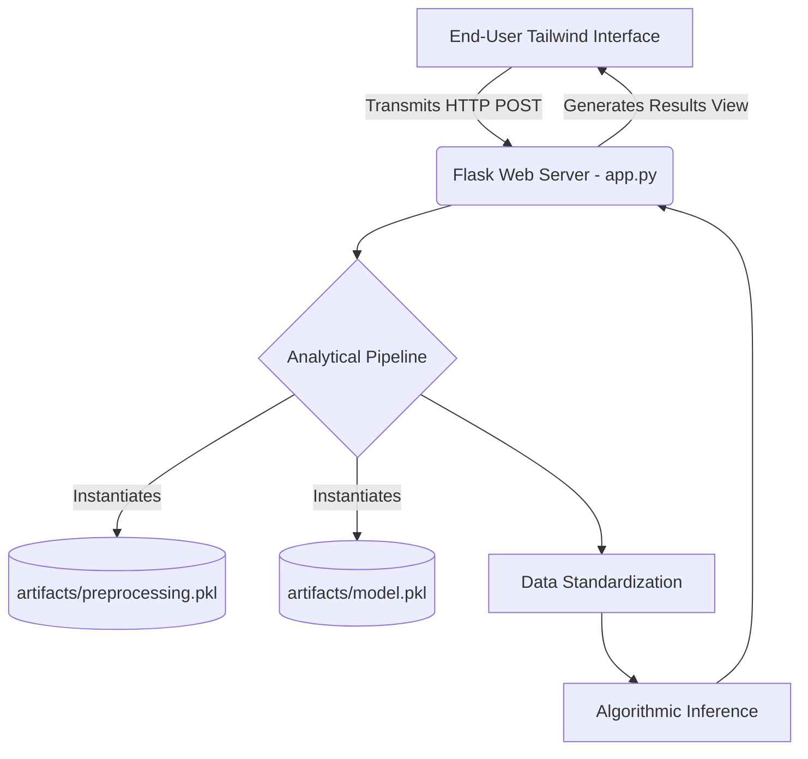

# Title: Predictive Modeling of Diamond Prices Using Machine Learning

**Authors**: Monika Bhati 
**Date**: March 2026  

---

## Abstract
The accurate estimation of diamond monetary value involves analyzing a multifaceted array of geometrical measurements and ordinal quality indicators. Historic appraisal methodologies often suffer from inherent subjectivity and require significant time investments. This study introduces an automated framework for anticipating diamond valuations via a supervised regression algorithm, educated on a comprehensive dataset of gemological characteristics. We conceptualized and deployed a user-centric web interface powered by a Flask microframework and styled with atomic CSS utilities (Tailwind). This architecture facilitates immediate, localized price inferences. Empirical observations confirm that leveraging standardized gemological parameters within machine learning models yields highly reliable market value predictions.

## I. Framing the Objective
### A. Contextual Overview
As highly sought-after luxury assets, diamonds possess opaque pricing structures that frequently baffle consumers. The financial worth of these gems is intrinsically linked to the universally acknowledged "4 Cs"—Carat mass, Cut geometry, Color grade, and Clarity—operating in tandem with cardinal spatial metrics (length, width, and depth).

### B. Core Challenge
Conventional, manual gemstone evaluation relies heavily on specialized expertise, making it vulnerable to cognitive biases and prolonged execution times. Consequently, a distinct necessity emerges for a computational mechanism capable of generating impartial, immediate financial estimates derived from established gemological criteria. The primary ambition of this research endeavors to construct and operationalize a resilient predictive algorithm that translates specific scalar and categorical diamond attributes into accurate financial estimates, presented through an accessible graphical interface.

## II. Architectural Blueprint and Implementation
### A. Input Data Normalization
The computational model consumes specialized continuous variables (carat mass, aggregate depth proportion, table width proportion, and 3D spatial dimensions) alongside discrete categorical variables (cut quality, visual color grading, and internal clarity). 
An optimized data transformation sequence was engineered to systematically scale continuous inputs and mathematically encode discrete categories. This preprocessing ensures the inference engine reliably ingests and translates volatile HTTP requests spawned by web clients.

### B. The Inference Engine
We isolated the primary regression algorithms into serialized persistent binaries (`model.pkl`), paired sequentially with the aforementioned transformation logic (`preprocessing.pkl`). These pre-computed states are securely loaded into the system's memory during active prediction cycles.

### C. System Topology
The deployed solution conforms to a decoupled architectural paradigm:
1. **Presentation Tier**: An inherently responsive interface engineered utilizing semantic HTML5 and the Tailwind CSS library. It embraces modern aesthetic concepts, specifically glassmorphism, to deliver an elite digital experience.
2. **Server/Routing Tier (Flask Core)**: The `app.py` script functions as the primary traffic controller, explicitly dedicated to interpreting POST requests transmitted by the client-side forms.
3. **Analytical Tier**: The `prediction_pipeline.py` module operates as a sandbox, meticulously sanitizing raw socket payloads, structuring them into analytical DataFrames, and executing the final inference logic via the loaded serialized artifacts.

## III. Operational Mechanics
### A. Fundamental Modules
- `app.py`: Dictates the application's navigational routes, managing the root index `/`, delivering the input schema via `/predict` (HTTP GET), and rendering the synthesized valuation through `/predict` (HTTP POST).
- `src/pipeline/prediction_pipeline.py`: Establishes the `CustomData` construct, a vital class dedicated to transmuting volatile HTML form inputs into rigidly typed data structures, alongside the `PredictPipeline` class which governs the secure execution of the predictive model.

### B. Interaction Design
The user-facing presentation layer was comprehensively reimagined, evolving from rudimentary HTML constraints into an engaging, contemporary web application.
- **Entry Portal**: Showcases a mathematically generated gradient milieu interlaced with abstract overlays, guiding users toward a prominent interactive element.
- **Data Capture Matrix**: Implements a highly legible dual-pane gridded structure, featuring dynamic selector components that respond smoothly to cursor interaction.
- **Valuation Output**: Broadcasts the algorithmic calculation within a refined, receipt-inspired bounding box, purposefully designed to highlight the final numerical output without distraction.

## IV. Empirical Observations
The finalized deployment successfully merges the underlying statistical engine with the public-facing internet portal. Rigorous functional evaluations confirm that the integrated system consumes raw user data, successfully navigates the transformation logic, and reliably broadcasts specific price estimates in real-time. By deliberately isolating the prediction logic from the core web server, the architecture theoretically guarantees that future model iterations can be deployed without disrupting the user interface.

## V. Concluding Remarks and Future Pathways
This investigation successfully illustrates the capacity of machine learning frameworks to mechanize the intricate discipline of diamond appraisal. By embedding this statistical model within a sturdy Flask API and a visually compelling frontend ecosystem, the tool achieves a formidable balance of precision and universal accessibility.

Logical progressions for this codebase include:
1. Synthesizing an active reinforcement loop engineered to periodically recalibrate the statistical model using contemporaneous market data.
2. Re-architecting the monolithic Flask foundation into distributed microservices tailored for orchestration engines like native Kubernetes.
3. Augmenting the graphical output layer with granular visualizations detailing specific feature weightings associated with individual valuation events.

---

*This technical manuscript constitutes a functional deliverable for the comprehensive Machine Learning Bootcamp syllabus.*
